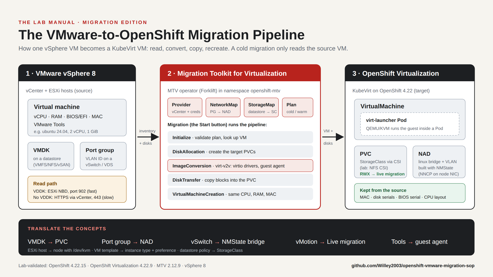
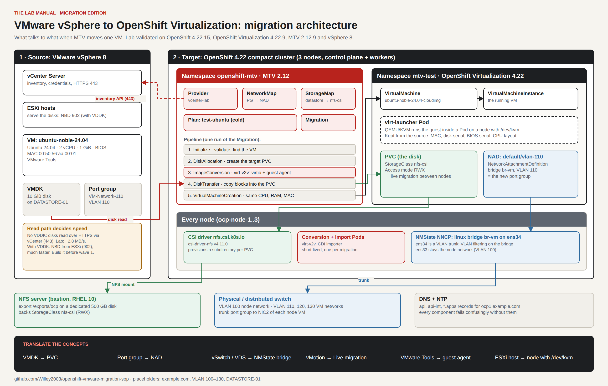

# VMware vSphere to OpenShift Virtualization: Migration SOP



An open-source standard operating procedure for moving virtual machines from VMware vSphere to Red Hat OpenShift Virtualization with the Migration Toolkit for Virtualization (MTV). It is written for VMware engineers who are new to Linux and Kubernetes. Every step has a web console path and an `oc` path. The command output comes from a real lab build, with hostnames and IP addresses replaced by placeholders.

<!-- Featured on LinkedIn: add "> **Featured on LinkedIn:** [read the launch post](URL) and join the discussion." here once the post is live -->

## Architecture



The diagram is editable: open [`assets/migration-architecture.drawio`](assets/migration-architecture.drawio) (or the PNG, which carries the diagram inside it) in [draw.io / diagrams.net](https://app.diagrams.net).

## What is in this repository

| Document | What it is | Read it |
|---|---|---|
| **The Lab Manual: Migration Edition** | A field manual in 10 chapters. It covers building the lab from an empty vSphere cluster to a migrated VM, with real terminal captures, GOTCHA boxes, exam tips and hands-on labs. | [PDF](lab-manual/LabManual.pdf) · [Markdown](lab-manual/LabManual.md) · [HTML](lab-manual/LabManual.html) · [DOCX](lab-manual/LabManual.docx) |
| **Migration SOP** | The reference procedure: foundations, platform, migration and production planning (FC, iSCSI, NFS, wave planning, runbook, rollback). | [Markdown](SOP.md) · [HTML](SOP.html) · [DOCX](SOP.docx) |
| **Quick start** | The one-sitting version: connect to OpenShift, then migrate one VM from vCenter, GUI and CLI side by side. | [Markdown](QUICKSTART.md) · [HTML](QUICKSTART.html) · [DOCX](QUICKSTART.docx) |
| **Cheat sheet** | 53 commands for OpenShift Virtualization and MTV on five pages. | [PDF](assets/cheat-sheet-carousel.pdf) |

The HTML files are self-contained. Download one and open it in a browser for the full layout, with the contents rail, terminal windows and dark mode.

## How to use

1. **Pick your entry point.**
   - If you are new to OpenShift, start with the Lab Manual at Chapter 1 and work through it in order. Each chapter builds on the one before.
   - If you already have a cluster and need to migrate a VM today, use the [Quick start](QUICKSTART.md).
   - If you are planning a production migration, read SOP Part D (storage, wave planning, the runbook and rollback).
2. **Check your versions.** The procedures were validated on the versions in the table below. Field names and console screens change between releases, so run `oc explain <kind>.spec` on your cluster before you copy any YAML.
3. **Replace the placeholders.** Every hostname, IP address, VLAN, datastore and port group is a documentation placeholder (`example.com`, `198.51.100.0/24`, `203.0.113.0/24`). Swap in your own values before you run anything.
4. **Follow the order: prepare, map, plan, migrate, validate.** Before you start, make sure the source VM has a clean shutdown path, the StorageClass supports RWX if you want live migration, and the VM network exists as a NetworkAttachmentDefinition.
5. **Practise in a lab first.** Run one small test VM end to end, as Chapter 9 of the Lab Manual does, before you plan waves.
6. **Keep the cheat sheet open.** [Appendix A](lab-manual/LabManual.md) and the [cheat-sheet PDF](assets/cheat-sheet-carousel.pdf) list the commands you will use during the migration.

## Lab Manual chapters

1. Linux for the Migration Engineer (RHEL 10)
2. Networking for the Cluster and the Migration
3. Installing OpenShift with the Agent-Based Installer
4. Day 1: Logging In, Users and Access
5. Storage: NFS, CSI and Persistent Volumes
6. OpenShift Virtualization: VMs as Pods
7. VM Networking: NMState, Bridges and VLANs
8. Migration Toolkit for Virtualization (MTV)
9. End to End: Migrating an Ubuntu 24.04 VM
10. Troubleshooting and Going to Production

Appendix A has the command cheat sheets, and Appendix B maps the manual to the EX316 exam objectives.

## Validated versions

| Component | Version |
|---|---|
| OpenShift Container Platform | 4.22.15 (Kubernetes 1.35.6) |
| OpenShift Virtualization | 4.22.9 |
| Migration Toolkit for Virtualization | 2.12.9 |
| Kubernetes NMState Operator | 4.22 |
| Storage | csi-driver-nfs v4.11.0 (RWX) |
| Source | VMware vSphere 8 |

The worked example is a cold migration of one 10 GiB Ubuntu VM without VDDK. Your timings will depend on your storage and network.

## Repository layout

| Path | Purpose |
|---|---|
| `lab-manual/src/*.md` | Master copy of the Lab Manual. Edit these. |
| `lab-manual/build.py` | Builds `LabManual.md`, `.html`, `.docx` and `.pdf` from `lab-manual/src/` |
| `src/*.md` | Master copy of the SOP |
| `quickstart-src/*.md` | Master copy of the quick start |
| `build.py`, `template.html` | Build and page layout for the SOP and quick start |
| `assets/` | The pipeline diagram (PNG and SVG), the editable draw.io architecture diagram and the cheat-sheet PDF |
| `images/`, `lab-manual/images/` | Screenshots. Save a capture as `S-nn.png` and the build places it in its placeholder. |

## Rebuild

```bash
pip install pypandoc_binary playwright
python3 build.py                                  # SOP
python3 build.py quickstart-src QUICKSTART        # quick start
cd lab-manual && python3 build.py                 # Lab Manual (the PDF step needs Chromium)
```

## Contributing

Corrections, results from other versions and production lessons are welcome. Open an issue or a pull request, and say which versions you tested on.

## License

[MIT](LICENSE). This is an independent community project. It is not affiliated with or endorsed by Red Hat, VMware or Broadcom.
